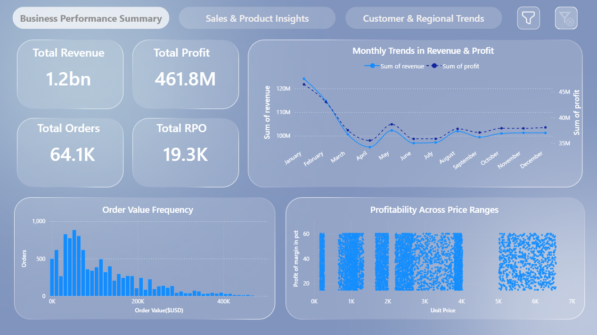
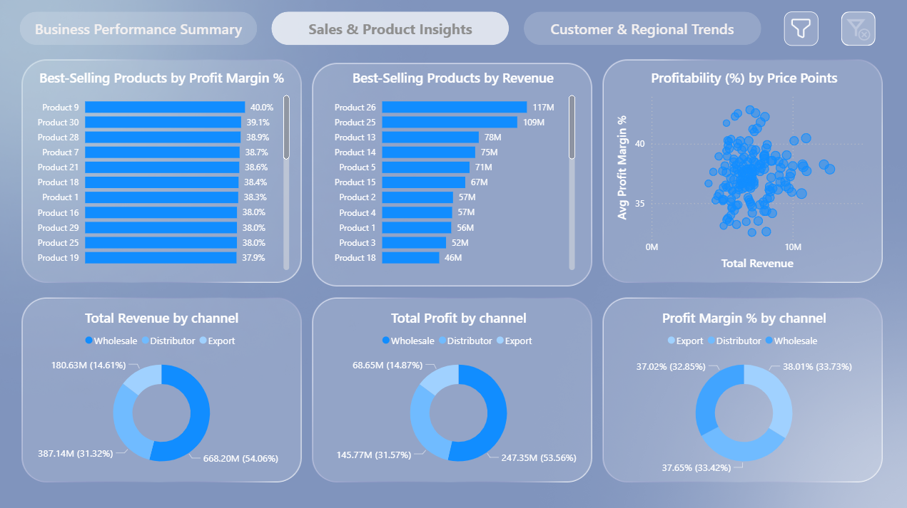
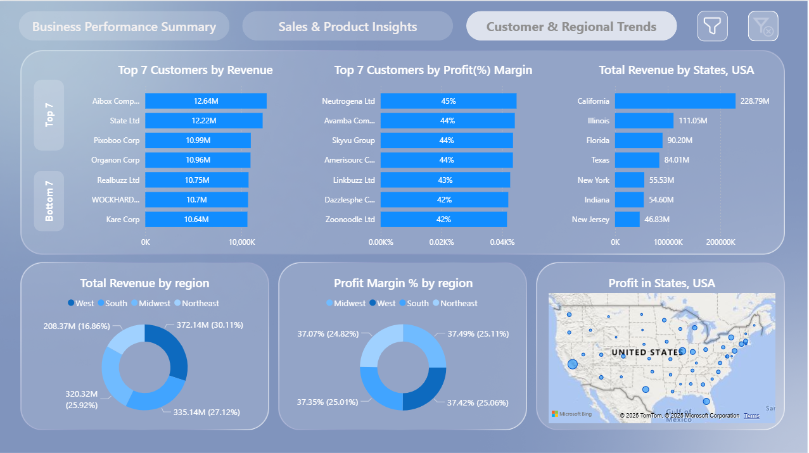
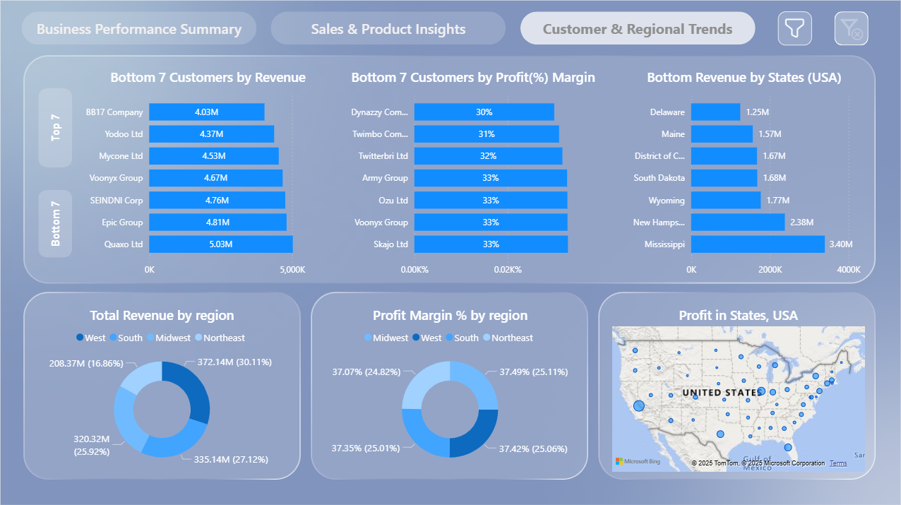
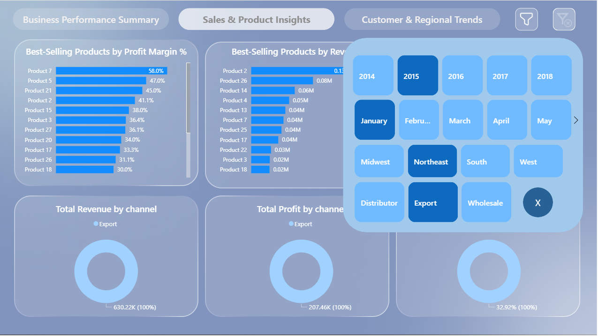

# Sales Analysis Dashboard 📊  

## 🔍 Project Overview  
This project focuses on **Sales & Business Performance Analysis** using a combination of **Python (EDA in Jupyter Notebook)** and **Power BI** for creating an **interactive dashboard**.  

The goal of this project is to provide stakeholders with **actionable insights** on revenue, profit, customers, and product performance across **regions, channels, and time periods**.  

---

## ⚙️ Project Workflow  

### 1️⃣ Exploratory Data Analysis (EDA) in Python  
- Data cleaning, preprocessing, and transformation performed in **Jupyter Notebook**.  
- Exploratory analysis (EDA) conducted to understand trends, outliers, and business drivers.  
- Insights from Python analysis were later visualized in Power BI.  

👉 You can check the complete EDA and notebook in my GitHub repository under `sales_analysis` project.  

### 2️⃣ Power BI Dashboard Creation  
- Built multiple dashboards for:  
  - **Business Performance Summary**  
  - **Sales & Product Insights**  
  - **Customer & Regional Trends**  

- Used **slicers** for filtering by:  
  - Year  
  - Month  
  - Sales Channel  
  - Region  

- Implemented **Bookmark & Selection Techniques** to:  
  - Hide/Show slicers using a **bookmark button**.  
  - Switch between **Top Customers** and **Bottom Customers** views in the Regional Dashboard.  

- Applied **DAX formulas** to calculate performance metrics and optimize dashboard performance.  

---

## 📈 Dashboard Insights  

### Business Problems Solved:  
1. **Revenue & Profitability Tracking**  
   - Overall business revenue = **1.2B** with profit = **461.8M**.  
   - Monthly revenue/profit trends allow management to detect **seasonality** and **performance dips**.  

2. **Customer Contribution Analysis**  
   - Identifies **Top Customers** driving maximum revenue.  
   - Highlights **Bottom Customers** with low revenue/profit margins → useful for sales strategy adjustments.  

3. **Regional & State-Level Insights**  
   - California is the **top-performing state** (228M revenue), while states like Delaware and Maine are **underperforming**.  
   - Regional segmentation shows balanced contributions across **Midwest, South, West, and Northeast**.  

4. **Product Performance**  
   - Top products ranked by **Revenue** and **Profit Margin %**.  
   - Helps business prioritize **high-margin products** while addressing low-performing SKUs.  

5. **Channel Effectiveness**  
   - Distribution, Export, and Wholesale channels compared for **Revenue, Profit, and Profit Margin %**.  
   - Shows that **Wholesale drives the majority of revenue**, but profit distribution is more balanced.  

---

## 📌 Key Features in Dashboard  
✔️ EDA in Python for data preparation & insights  
✔️ Interactive **Power BI dashboards**  
✔️ **Slicers with hidden toggle functionality** using bookmarks  
✔️ **Top vs Bottom performance views** with bookmark buttons  
✔️ Optimized using **DAX measures** for faster performance  

---

## 📸 Dashboard Screenshots  

### Business Performance Summary  
  

### Sales & Product Insights  
  

### Customer & Regional Trends – Top Customers  
  

### Customer & Regional Trends – Bottom Customers  
  

### Filter Panel with Bookmarks  
  

---

## 🚀 Conclusion  
This project demonstrates how **Python-based EDA** combined with **Power BI visualizations** can deliver a **360° view of sales performance**.  

The dashboard helps business leaders:  
- Identify growth opportunities  
- Address weak customer/product segments  
- Optimize sales strategies across channels and regions  

---

## 🔗 More About This Project  
Check out the repository for:  
- Python EDA Notebooks  
- Power BI PBIX File  
- Detailed Analysis Steps  

👉 Visit my GitHub account to explore more about this **jupy_Sales_Analysis_EDA_PROCESS**.  

---
👨‍💻 **Created with Python, Power BI & DAX**  
